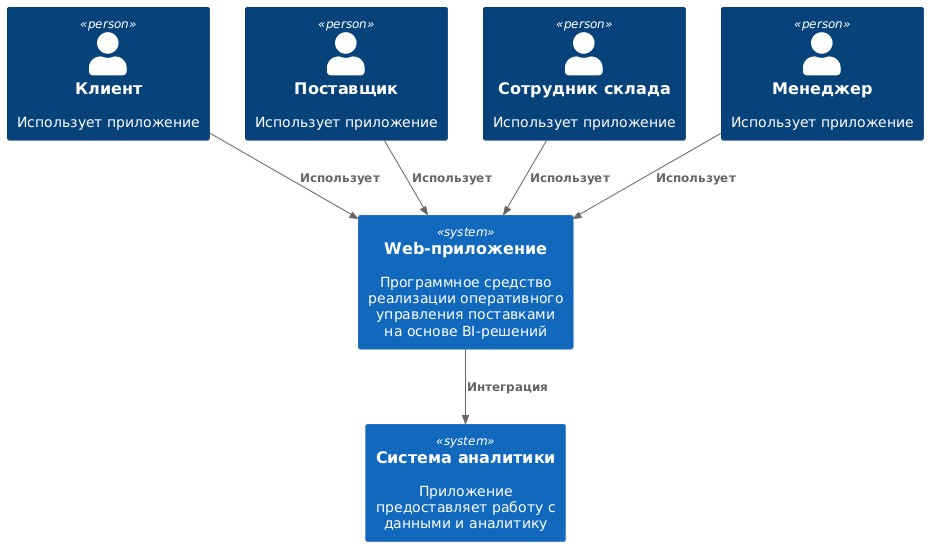
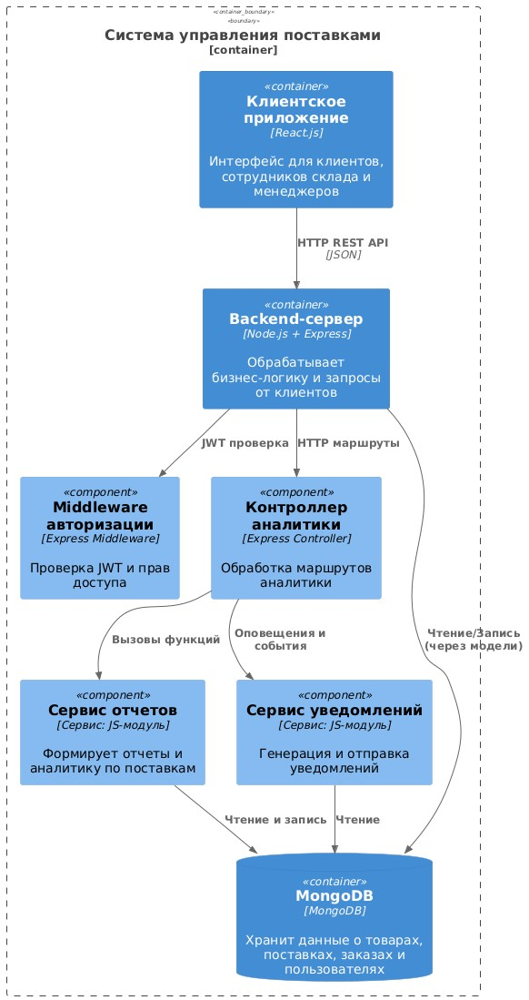
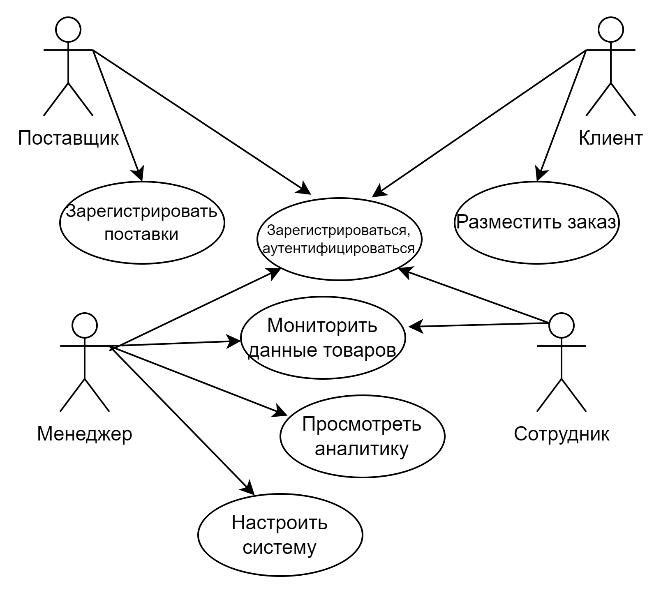
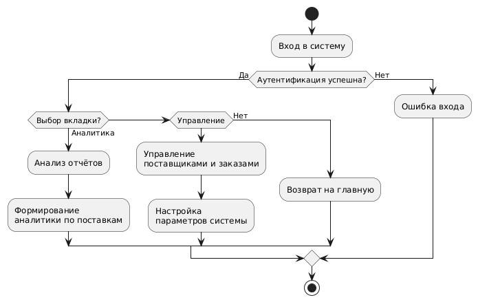
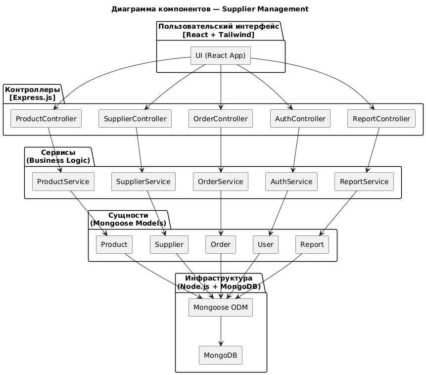

# **Программное средство реализации оперативного управления поставками на основе BI-решений**

Данный проект представляет собой комплексную программную систему для автоматизации процессов управления поставками, реализованную с применением современных BI-подходов, архитектурных шаблонов и технологического стека. Система позволяет управлять товарами, поставщиками, осуществлять расчёты себестоимости, формировать аналитические отчёты, а также производить регистрацию и отслеживание перемещений поставок.
Проект выполнен в рамках дисциплины «Рефакторинг и оптимизация программного кода» студентом группы 214371 Наврозовым Даниилом Викторовичем.

**Сервер**: [https://github.com/defffis/NavrozovDV_214371_RIOPK_Server](https://github.com/defffis/NavrozovDV_214371_RIOPK_Server)  
**Клиент**: [https://github.com/defffis/NavrozovDV_214371_RIOPK_Front](https://github.com/defffis/NavrozovDV_214371_RIOPK_Front)

---

## **Содержание**

1. [Архитектура](#архитектура)
2. [Функциональные возможности](#функциональные-возможности)
3. [Детали реализации](#детали-реализации)
4. [Тестирование](#тестирование)
5. [Установка и запуск](#установка-и-запуск)
6. [Лицензия](#лицензия)
7. [Контакты](#контакты)

---

## **Архитектура**

### C4-модель

#### Контекстный уровень


#### Контейнерный уровень


#### Компонентный уровень


#### Кодовый уровень


### Схема данных


```sql
-- SQL-скрипт для создания базы данных
import mongoose from "mongoose";

const batchesSchema = new mongoose.Schema({
  batch_num: {
    type: String,
    required: true,
  },
  package_id: {
    type: mongoose.ObjectId,
    ref: "Packages",
    required: true,
  },
  location: {
    type: mongoose.ObjectId,
    ref: "Location",
    required: true,
  },
  status: {
    type: String,
    default: "На складе",
    enum: ["На складе", "Отправлено", "Продано", "Возврат"],
  },
});

export default mongoose.model("Batches", batchesSchema);
import mongoose from "mongoose";

const categorySchema = new mongoose.Schema({
  name: {
    type: String,
    required: true,
    unique: true,
  },
  slug: {
    type: String,
    lowercase: true,
  },
});

export default mongoose.model("Category", categorySchema);
import mongoose from "mongoose";

const locationSchema = new mongoose.Schema({
  address: {
    type: String,
    required: true,
  },
  type: {
    type: String,
    required: true,
    enum: ["Логистический центр", "Точка выдачи", "Склад", "Магазин"],
  },
});

export default mongoose.model("Location", locationSchema);
import mongoose from "mongoose";

const movementSchema = new mongoose.Schema({
  batch_id: {
    type: mongoose.ObjectId,
    ref: "Batches",
    required: true,
  },
  location_from: {
    type: mongoose.ObjectId,
    ref: "Location",
    required: true,
  },
  location_to: {
    type: mongoose.ObjectId,
    ref: "Location",
    required: true,
  },
  movement_date: {
    type: Date,
    required: true,
  },
});

export default mongoose.model("Movement", movementSchema);
import mongoose from "mongoose";

const packagesSchema = new mongoose.Schema({
  package_num: {
    type: String,
    required: true,
  },
  product_id:{
    type: mongoose.ObjectId,
    ref: "Products",
    required: true,
  },
  manufacture_date: {
    type: Date, 
    required: true,  
  },
  expiration_date: {
    type: Date,  
    required: true,  
  },
});

export default mongoose.model("Packages", packagesSchema);
import mongoose from "mongoose";

const productSchema = new mongoose.Schema(
  {
    name: {
      type: String,
      required: true,
    },
    price: {
      type: Number,
      required: true,
    },
    category: {
      type: mongoose.ObjectId,
      ref: "Category",
      required: true,
    },
    location: {
      type: mongoose.ObjectId,
      ref: "Location",
      required: true,
    },
    quantity: {
      type: Number,
      required: true,
    },
    supplier: {
      type: mongoose.ObjectId,
      ref: "Supplier",
      required: true,
    },
    serial_num: {
      type: String,
      required: true,
      unique: true,
    }
  },
);

export default mongoose.model("Products", productSchema);
import mongoose from "mongoose";

const supplierSchema = new mongoose.Schema({
  sup_name: {
    type: String,
    required: true,
  },
  info: {
    type: String,
    required: true,
  },
});

export default mongoose.model("Supplier", supplierSchema);
import mongoose from 'mongoose'
import validator from 'validator'

const userSchema = new mongoose.Schema(
  {
    name: {
      type: String,
      required: true,
      trim: true,
    },
    email: {
      type: String,
      required: true,
      unique: true,
    },
    password: {
      type: String,
      required: true,
    },
    role: {
      type: Number,
      default: 0,
    },
  },
  { timestamps: true }
);

// static signup method
userSchema.statics.signup = async function (name, email, password) {

  if (!validator.isEmail(email)) {
    throw Error('Email not valid')
  }

  const exists = await this.findOne({ email })

  if (exists) {
    throw Error('Email already in use')
  }

  // const salt = await bcrypt.genSalt(10)
  // const hash = await bcrypt.hash(password, salt)

  // const user = await this.create({ email, password: hash })
  const user = await this.create({ name, email, password })

  return user
}

// static login method
userSchema.statics.login = async function (email, password) {

  if (!email || !password) {
    throw Error('All fields must be filled')
  }

  const user = await this.findOne({ email })
  if (!user) {
    throw Error('Incorrect email')
  }

  // const match = await bcrypt.compare(password, user.password)
  if (!password == user.password) {
    throw Error('Incorrect password')
  }

  return user
}

export default mongoose.model("User", userSchema); 

```

---

## **Функциональные возможности**

### Диаграмма вариантов использования


### User-flow диаграмма





---

## **Детали реализации**

### UML-диаграммы

#### Диаграмма классов


#### Диаграмма последовательностей


#### Диаграмма компонентов


### Спецификация API

API реализован в стиле REST, примеры запросов:

* `POST /api/auth/register`
* `POST /api/auth/login`
* `GET /api/products`
* `POST /api/supplies`
* `GET /api/statistics`

#### Настройка API


### Безопасность

#### Метод шифрования пароля


### Оценка качества кода

- Cyclomatic Complexity: 1–3 для большинства методов
- Maintainability Index: 75–100 (высокая поддерживаемость)
- Lines of Code: ~700 строк в проекте
- Code Coverage (unit + интеграц.): около 78%
- Code Smells: 0 критических, 2 незначительных


## **Тестирование**

### Unit-тесты

Основные характеристики:
- Тестируется один метод или модуль.
- Внешние зависимости (например, базы данных) мокаются.
- Быстрое выполнение.
- Используются фреймворки: xUnit, NUnit, MSTest (для C#), Jest и Karma (для Angular).


#### Пример тестируемого метода написанный на Jest


#### Unit-тест


### Интеграционные тесты

#### Пример интеграционного теста контроллера /api/products 


## **Установка и запуск**

1. Установить Node.js и MongoDB
2. Клонировать репозитории и установить зависимости:

   ```bash
   npm install
   ```
3. Создать файл `.env` в backend с параметрами подключения к БД
4. Запустить backend и frontend:

   ```bash
   npm run dev     # для backend
   npm start       # для frontend
   ```
5. Доступ по адресам:

   * Backend: [http://localhost:5000](http://localhost:5000)
   * Frontend: [http://localhost:3000](http://localhost:3000)

## Тестирование

* Backend: `npm run test`
* Frontend: `npm run test`
* Покрытие тестами: >75%


## **Лицензия**

Этот проект лицензирован по лицензии MIT – подробности в файле [LICENSE.md](LICENSE.md)

---

## **Контакты**

Автор: Наврозов Даниил  
Email: navrozov.dan@gmail.com
